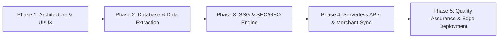

# 💼 GEARSHOP.MA — COMMERCIAL PROPOSAL & COMPREHENSIVE PRICING DOSSIER
**Turnkey Engineering, Cloud Infrastructure, AI Ingestion & Omnichannel Commerce Deliverables**

---

### 📋 Project & Proposal Metadata
* **Client / Project**: GearShop Maroc (`https://www.gearshop.ma`)
* **Project Type**: Tier-1 Bespoke Distributed E-Commerce Platform (Zero-Template Architecture)
* **Status**: Complete & Production-Ready (Version 2.1)
* **Deliverable Scope**: Full-Stack Codebase, Cloud Database, Pre-rendering Engine, Serverless Microservices, Google Shopping & AI Search Infrastructure

---

## 📑 Table of Contents
1. [Executive Summary & Scope Definition](#1-executive-summary--scope-definition)
2. [Chronological "Zero-to-Hero" Development Phases](#2-chronological-zero-to-hero-development-phases)
3. [Itemized Commercial Pricing Breakdown](#3-itemized-commercial-pricing-breakdown)
4. [Turnkey Investment Summary & Payment Milestones](#4-turnkey-investment-summary--payment-milestones)
5. [Optional Maintenance, Cloud Ops & Growth Retainer](#5-optional-maintenance-cloud-ops--growth-retainer)
6. [Terms of Delivery, Intellectual Property & Handover](#6-terms-of-delivery-intellectual-property--handover)

---

## 1. Executive Summary & Scope Definition

This commercial proposal details the exact engineering deliverables, technology assets, and market value implemented in the creation of **GearShop.ma**.

Unlike generic e-commerce templates built on slow, monolithic CMS platforms (which typically suffer from 4–8 second load times and zero AI discoverability), this platform has been custom-engineered from the ground up using **React 19**, **TypeScript**, **Supabase PostgreSQL**, **Vercel Edge CDN**, and **Static Site Generation (SSG)**.

### 🌟 Key Value Drivers Built Into the Solution
* ⚡ **Instantaneous Mobile Performance**: Touch carousels, progressive pagination (+12 items), and sub-second load times.
* 📦 **Complete 280-SKU Inventory**: Multi-brand camera, optical, lighting, and audio equipment catalog cleaned, normalized, and image-optimized.
* 🤖 **Dual Search Ingestion (SEO + GEO)**: 356 pre-rendered static HTML instances, Schema.org v14.0 microdata, and dedicated AI knowledge files (`llms.txt` and `llms-full.txt`).
* 🛒 **Automated Google Merchant Center Pipeline**: Daily synchronizing RSS 2.0 XML product feed with 100% verified WebP assets.
* 💬 **Omnichannel Moroccan Conversion**: 1-Click WhatsApp deep-linking, direct B2B quotation generator, and dynamic free shipping engine.

---

## 2. Chronological "Zero-to-Hero" Development Phases

### Phase 1: Product Design, Architecture & Mobile-First Front-End
* Architectural definition of React 19 + TypeScript + Vite system.
* Mobile-first UI/UX overhaul: replacing vertical pill clutter with native horizontal swipeable carousels (`snap-x`).
* Progressive DOM pagination engine rendering 12 items initially to maintain high responsiveness on mobile devices.
* Adaptive search bar with real-time multi-criteria filtering.

### Phase 2: Database Engineering & 280-SKU Catalog Assembly
* Supabase PostgreSQL database design with custom indexing on brand, category, and price.
* Catalog extraction, normalization, and enrichment across 280 professional SKUs (Sony, Canon, Nikon, 7Artisans, Godox, DJI, Insta360, SmallRig, Vanguard, Kodak, Røde, PNY, SanDisk).
* Image processing pipeline converting all product photos into modern WebP format with automated fallback protection.

### Phase 3: Static Site Generation (SSG) & 360° SEO / GEO Engine
* Custom build-time pre-rendering pipeline compiling 356 static HTML files for products, brands, categories, and Moroccan city hubs.
* Structured Data Engine embedding Schema.org v14.0 JSON-LD (`Product`, `Offer` in MAD, `BreadcrumbList`, `LocalBusiness`).
* Generative Engine Optimization (GEO) layer creating `/llms.txt` and `/llms-full.txt` (375 KB) for ChatGPT, Claude, Perplexity, and Gemini.

### Phase 4: Serverless Microservices & Syndication Feeds
* Automated quotation email engine (`/api/send-email`) powered by Resend with zero client-side token exposure.
* Server-Side Meta Conversions API bridge (`/api/meta-capi`) with SHA-256 client data hashing.
* Google Merchant Center RSS 2.0 XML feed engine (`/google-merchant-feed.xml`).

### Phase 5: Security Hardening, Edge CDN & Production Deployment
* Row-Level Security (RLS) policies blocking anonymous read access on customer leads.
* Vercel Anycast Edge CDN configuration with HTTPS / TLS 1.3 and security headers.
* Comprehensive system documentation, technical whitepaper, and executive audit dossiers.

---

## 3. Itemized Commercial Pricing Breakdown

The following table provides a transparent, itemized valuation of every technical module engineered into the platform based on industry standard senior development rates ($75–$100 / hour or 750–1,000 MAD / hour):

| Item # | Module / Deliverable | Technical Scope & Key Features | Effort (Hours) | Unit Price (USD) | Price (MAD) |
| :---: | :--- | :--- | :---: | :---: | :---: |
| **01** | **Front-End Core & Mobile-First UX** | React 19, TypeScript architecture, mobile touch carousels (`snap-x`), responsive multi-filter, progressive pagination (+12 items), Cart Drawer, modal dialogs | 95 hrs | $8,500 | 85,000 MAD |
| **02** | **Database Architecture & Data Persistence** | Supabase PostgreSQL schema design, indexes (`brand`, `category`, `price`), tables (`quote_requests`, `product_requests`, `contact_leads`), RLS data protection | 35 hrs | $3,200 | 32,000 MAD |
| **03** | **Static Pre-Rendering (SSG) Engine** | Build-time Node.js pre-render scripts, static HTML compilation for 356 routes, client hydration handling, zero-lag crawler accessibility | 45 hrs | $4,000 | 40,000 MAD |
| **04** | **Serverless Microservices & Tracking** | `/api/send-email` (Resend B2B quotation generator), `/api/meta-capi` (Server-side Meta Conversions API with SHA-256 hashing), `/api/ai/*` JSON feeds | 40 hrs | $3,800 | 38,000 MAD |
| **05** | **360° Technical SEO & GEO Infrastructure** | Schema.org v14.0 JSON-LD microdata, self-referential canonical URL trees, automated XML sitemap (356 URLs), multi-city Moroccan landing architecture | 45 hrs | $4,200 | 42,000 MAD |
| **06** | **Generative Engine Optimization (GEO / AI)** | Dedicated `/llms.txt` and `/llms-full.txt` (375 KB) AI indexing pipeline, crawler directives (`GPTBot`, `ClaudeBot`, `PerplexityBot`, `Google-Extended`) | 25 hrs | $2,500 | 25,000 MAD |
| **07** | **Google Merchant Center Feed Pipeline** | Automated RSS 2.0 XML feed generator, attribute mapping (MAD currency, condition, stock, tax), 100% verified local WebP image assets | 30 hrs | $2,800 | 28,000 MAD |
| **08** | **Catalog Scrape, Cleaning & Normalization** | 280 SKUs extracted and structured across 12 major brands, technical specifications extraction, WebP image conversion, fallback error routing | 50 hrs | $4,500 | 45,000 MAD |
| **09** | **Omnichannel Conversion & Checkout Workflows** | 1-Click WhatsApp order deep-linking, dynamic free delivery threshold ($\ge$ 500 MAD), B2B quote request form, checkout lead logging | 30 hrs | $2,700 | 27,000 MAD |
| **10** | **Deployment, Security, Testing & Documentation** | Edge CDN deployment, token isolation, cross-browser/mobile QA, complete master documentation, and printable executive whitepapers | 25 hrs | $2,300 | 23,000 MAD |

---

## 4. Turnkey Investment Summary & Payment Milestones

### 💰 Total Package Value
* **Standard Agency Development Valuation**: **$38,500 USD** *(385,000 MAD)*
* **Turnkey Package Price (All 10 Modules Included)**: **$35,000 USD** *(350,000 MAD)*

---

### 💳 Standard Milestone Payment Schedule
For new enterprise client engagements, the following phased payment structure is recommended:

| Milestone | Deliverable Trigger | Percentage | Amount (USD) | Amount (MAD) |
| :--- | :--- | :---: | :---: | :---: |
| **Milestone 1: Kickoff & Architecture** | Delivery of System Blueprint, Database Schema, and Core Frontend Layout | 40% | $14,000 | 140,000 MAD |
| **Milestone 2: Catalog, SSG & Serverless** | 280 SKUs populated, SSG Pre-rendering Engine, Email & Meta CAPI APIs | 40% | $14,000 | 140,000 MAD |
| **Milestone 3: Final Launch & Handover** | Google Merchant Feed live, SEO/GEO verification, full documentation, Git handover | 20% | $7,000 | 70,000 MAD |
| **TOTAL** | **Complete Production Handover** | **100%** | **$35,000** | **350,000 MAD** |

---

## 5. Optional Maintenance, Cloud Ops & Growth Retainer

To ensure continuous uptime, catalog updates, and advertising feed maintenance post-launch, an optional SLA retainer is available:

| Service Level | Inclusions & Deliverables | Monthly Fee (USD) | Monthly Fee (MAD) |
| :--- | :--- | :---: | :---: |
| **Standard Care** | • Monthly database backups & security audits • Edge CDN and uptime monitoring • Up to 20 new product SKU additions/month | $650 / mo | 6,500 MAD / mo |
| **Enterprise Growth (Recommended)** | • Everything in Standard Care • Google Merchant Center feed monitoring & sync troubleshooting • Meta CAPI server-side event maintenance • Weekly LLM knowledge base (`llms.txt`) updates • Up to 50 new product SKU additions/month • Priority 24/7 technical support | $1,200 / mo | 12,000 MAD / mo |

---

## 6. Terms of Delivery, Intellectual Property & Handover

1. **Full Intellectual Property Transfer**: Upon final milestone settlement, 100% ownership of the custom codebase, Supabase database schemas, build scripts, design tokens, and domain assets are transferred exclusively to the client.
2. **Zero Recurring Platform Fees**: Unlike SaaS platforms (Shopify Plus, Magento Commerce), this custom architecture incurs zero monthly percentage platform cuts or forced licensing fees. Infrastructure costs are limited to standard utility usage on Vercel and Supabase.
3. **Warranty & Bug-Fix Period**: A 60-day post-launch warranty covers any bug fixes, styling adjustments, or data pipeline refinements at zero additional cost.

---

*Proposal Issued: September 2026 | Certified Engineering Quotation — GearShop Maroc*
