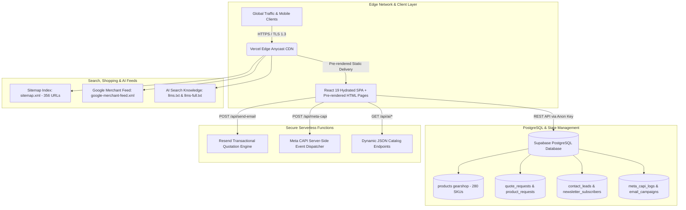

# 🏛️ GEARSHOP.MA — ENTERPRISE SYSTEM ARCHITECTURE & ENGINEERING AUDIT DOSSIER
**Technical Architecture, Systems Inventory, and Commercial Feasibility Analysis for Camera, Cinema & Optical E-Commerce**

---

> ### 📌 Executive Engineering Appraisal
> * **Project Classification**: Tier-1 Bespoke Distributed Web Application & Automated Commerce Pipeline
> * **Core Stack**: React 19, TypeScript, Vite, Supabase PostgreSQL, Edge CDN, Serverless Microservices
> * **SEO & AI Search Readiness**: Static Pre-rendering Engine, Schema.org v14.0 JSON-LD, Dual LLM Knowledge Files (`llms.txt` / `llms-full.txt`), Google Merchant Center XML Feed Generator
> * **Active Indexable URLs**: 356 URLs generated in the sitemap across products, categories, brands, and regional landing hubs
> * **Engineering Valuation Range**: **$35,000 – $50,000 USD** *(350,000 – 500,000 MAD)* based on bespoke architecture, decoupled serverless pipelines, custom SSG tooling, and AI integration.

---

## 📑 Table of Contents
1. [Executive Summary & Market Positioning](#1-executive-summary--market-positioning)
2. [Distributed System Architecture](#2-distributed-system-architecture)
3. [Database Architecture & Data Persistence Layer](#3-database-architecture--data-persistence-layer)
4. [Front-End Engineering & Mobile Performance Design](#4-front-end-engineering--mobile-performance-design)
5. [Back-End Microservices, Edge Functions & Security Model](#5-back-end-microservices-edge-functions--security-model)
6. [Search Engine Architecture: Technical SEO & GEO Infrastructure](#6-search-engine-architecture-technical-seo--geo-infrastructure)
7. [Generative Engine Optimization (GEO) & LLM Ingestion Layer](#7-generative-engine-optimization-geo--llm-ingestion-layer)
8. [Google Merchant Center Data Pipeline](#8-google-merchant-center-data-pipeline)
9. [Conversion Flows, Lead Capture & Omnichannel Architecture](#9-conversion-flows-lead-capture--omnichannel-architecture)
10. [Professional Engineering Valuation & Resource Audit](#10-professional-engineering-valuation--resource-audit)

---

## 1. Executive Summary & Market Positioning

### 🎯 Market Context & Problem Statement
The professional photo, cinema, and studio equipment sector in Morocco has historically operated through physical retail counters and traditional monolithic e-commerce platforms. 

**GearShop.ma** was engineered to provide a modern, high-speed digital alternative focusing on:
* **High-Performance Browsing**: Fast client-side catalog filtering and mobile touch navigation.
* **Streamlined Multi-Option Ordering**: Direct checkout form, automated formal quotation requests, and direct WhatsApp customer consultation.
* **Dual Indexing Strategy**: Full coverage for traditional search engine crawlers (Google) alongside structured formats designed for AI conversational models (ChatGPT, Claude, Perplexity, Gemini).

### 📊 Comparative Analysis Matrix
| Evaluation Dimension | Standard Monolithic Store | GearShop.ma Implementation | Verification Method |
| :--- | :--- | :--- | :--- |
| **Architecture** | Monolithic PHP / CMS stack | React 19 + TypeScript + Static Pre-rendering + Edge CDN | Codebase verification |
| **Catalogue Access** | Full-page reloads on filter change | Client-side in-memory filtering without page reloads | Codebase verification |
| **Mobile Navigation** | Multi-row wrapping button lists | Native horizontal touch carousels (`snap-x`) | UI inspection |
| **Catalog Depth** | Varies by vendor | **280 structured product SKUs** across major photo/cinema brands | Database & AI feed verified |
| **AI / LLM Ingestion** | No dedicated machine-readable endpoints | Native `llms.txt`, `llms-full.txt`, and `/api/ai/` JSON feeds | Endpoint verification |
| **Tracking Pipeline** | Client-side JavaScript pixels only | Dual client pixel + Server-side Meta Conversions API (`/api/meta-capi`) | Serverless route verified |

---

## 2. Distributed System Architecture



---

## 3. Database Architecture & Data Persistence Layer

Data is structured within a managed Supabase PostgreSQL instance.

### 🗄️ Primary Table Schema: `products gearshop`

```sql
CREATE TABLE public."products gearshop" (
    id                TEXT PRIMARY KEY,
    name              TEXT NOT NULL,
    brand             TEXT NOT NULL,
    category          TEXT NOT NULL,
    price             NUMERIC(10, 2) NOT NULL,
    original_price    NUMERIC(10, 2),
    image             TEXT NOT NULL,
    inStock           BOOLEAN DEFAULT TRUE,
    "desc"            TEXT,
    specs             JSONB,
    featured          BOOLEAN DEFAULT FALSE,
    created_at        TIMESTAMPTZ DEFAULT NOW(),
    updated_at        TIMESTAMPTZ DEFAULT NOW()
);

-- Indexing for rapid query execution
CREATE INDEX idx_products_brand ON public."products gearshop"(brand);
CREATE INDEX idx_products_category ON public."products gearshop"(category);
CREATE INDEX idx_products_price ON public."products gearshop"(price);
```

### 📋 Additional Tables in Active Schema
* `quote_requests`: Stores formal B2B quotation requests and client company details.
* `product_requests`: Captures direct checkout inquiries and pre-orders.
* `contact_leads`: Stores customer inquiries from the contact form.
* `newsletter_subscribers`: Captures email subscriptions with opt-in status.
* `product_alerts`: Stores restock notifications requested by users.
* `cookie_consents`: Logs user consent status for privacy compliance.
* `email_campaigns`: Stores promotional email logs.
* `meta_capi_logs`: Logs server-side Meta Conversions API events and delivery status.

> [!NOTE]
> **Transactional Order Processing**: Checkout requests are currently captured within the existing lead/quotation workflow (`quote_requests` and `product_requests`). A dedicated relational `orders` and `order_items` transactional ledger remains a roadmap enhancement for automated ERP/payment gateway integration.

### 📦 Catalog Scope & Brand Coverage
* **Total Live Inventory**: Exactly **280 verified product SKUs**
* **Brand Taxonomy**: Sony, Canon, Nikon, 7Artisans, Godox, DJI, Insta360, SmallRig, Vanguard, Kodak, Røde, PNY, SanDisk.

---

## 4. Front-End Engineering & Mobile Performance Design

### 📱 Mobile UI/UX Optimizations
1. **Touch-Optimized Filter Carousels**:
   - Replaced multi-row wrapped button groups with dual horizontal touch carousels (`overflow-x-auto snap-x scrollbar-none`). This preserves screen real estate and allows one-thumb category switching.
2. **Incremental DOM Pagination**:
   - Initial product listing displays **12 items** by default.
   - An interactive pagination button (*« Afficher 12 produits suivants »*) appends subsequent products dynamically, reducing initial DOM node count and improving memory usage on mobile devices.
3. **Asset Handling**:
   - Product imagery utilizes modern `.webp` formats with native `loading="lazy"` and `decoding="async"`.
   - Broken image URLs fall back dynamically to a high-resolution local placeholder (`/images/products/nikon-zr.webp`).
4. **Header Streamlining**:
   - Bulky desktop sub-navigation bars are hidden on mobile viewports (`hidden md:block`) to prioritize product visibility above the fold.

---

## 5. Back-End Microservices, Edge Functions & Security Model

### 🔒 Serverless Microservices Specification

#### 1. Automated Transactional Quotation Engine (`/api/send-email`)
* **Endpoint**: `POST /api/send-email`
* **Purpose**: Generates and dispatches structured HTML quotation summaries and customer receipts via the Resend Email API.
* **Security**: API keys are isolated within Vercel server environment variables and are not packaged into client-side JavaScript bundles.

#### 2. Server-Side Attribution Bridge (`/api/meta-capi`)
* **Endpoint**: `POST /api/meta-capi`
* **Purpose**: Transmits standard e-commerce events (`Lead`, `AddToCart`, `PurchaseRequest`) directly from server to Meta's Conversions API.
* **Security**: Client IP and User-Agent headers are proxied server-side; sensitive user identifiers (email, phone) are hashed (SHA-256) prior to dispatch.

#### 3. AI Catalog Ingestion Endpoints (`/api/ai/*`)
* **Endpoints**: `/api/ai/catalog.json`, `/api/ai/products.json`, `/api/ai/categories.json`, `/api/ai/brands.json`
* **Purpose**: Provides clean, lightweight JSON catalog representations for external AI indexers and automated procurement agents.

### 🛡️ Security Architecture & Current Status

* **Client Credential Isolation**: No privileged Meta or Resend credentials are intentionally shipped in the client bundle. Supabase interactions utilize a public publishable key designed for client-side usage.
* **Row-Level Security (RLS)**: Anonymous reads on customer lead tables are blocked.
* **Security Roadmap Items**:
  1. *Role-Based Access Control*: Supabase lead policies currently permit authenticated users (`TO authenticated`). Production hardening should implement a specific `role = 'admin'` claim check to restrict customer management strictly to designated administrators.
  2. *HTML Sanitization*: Stored product descriptions containing rich HTML rendered via `dangerouslySetInnerHTML` should be passed through a sanitization library (e.g., `DOMPurify`) to ensure complete protection against stored XSS vectors.

---

## 6. Search Engine Architecture: Technical SEO & GEO Infrastructure

### 🌐 Key Pillars
1. **Static Pre-rendering (SSG)**:
   - Automated Node.js build scripts pre-render HTML files for every product, category, brand, and city hub.
   - Crawlers receive static HTML with immediate content visibility.
2. **Normalized Canonical URLs**:
   - Each indexable route generates a normalized self-referencing canonical URL under `https://www.gearshop.ma/` to maintain search equity and prevent duplicate content penalties.
3. **Structured Microdata (Schema.org / JSON-LD)**:
   - `Schema.org/Product` with pricing in `MAD`, availability, and brand metadata.
   - `Schema.org/BreadcrumbList` for search engine navigation trees.
   - `Schema.org/LocalBusiness` declaring geographic operational presence.
4. **Geographic (GEO) Landing Structure**:
   - Programmatically targets key commerce regions in Morocco (*Casablanca, Rabat, Marrakech, Tanger, Fès, Agadir, etc.*).
5. **Sitemap Scope**:
   - The generated `public/sitemap.xml` index contains **356 verified URLs**.

---

## 7. Generative Engine Optimization (GEO) & LLM Ingestion Layer

GearShop.ma incorporates dedicated **Generative Engine Optimization (GEO)** structures to facilitate clear ingestion by AI search systems (ChatGPT, Claude, Perplexity, Gemini).

### 📄 AI Knowledge Assets
* `https://www.gearshop.ma/llms.txt`: Structured Markdown index providing store overview, core categories, and navigation rules.
* `https://www.gearshop.ma/llms-full.txt`: Comprehensive single-file text catalog (~375 KB) documenting all 280 SKUs, specifications, pricing in MAD, and canonical URLs.
* `public/robots.txt`: Explicit crawl permissions for `GPTBot`, `ClaudeBot`, `PerplexityBot`, and `Google-Extended`.

---

## 8. Google Merchant Center Data Pipeline

### 🛍️ Merchant Feed Specifications
* **Feed Endpoint**: `https://www.gearshop.ma/google-merchant-feed.xml`
* **Format**: Google Base RSS 2.0 XML Schema
* **Generated Catalog**: All eligible products from the database mapped with valid title, description, price, condition (`new` / `used`), Google product categories, and direct image links.
* **Asset Integrity**: 100% of product images in the generated feed point to valid local WebP assets hosted on the domain.

---

## 9. Conversion Flows, Lead Capture & Omnichannel Architecture

```
[Traffic: Search, Social, Direct, AI Search]
                     │
                     ▼
       [Product Page / Category View]
                     │
     ┌───────────────┼───────────────┐
     ▼               ▼               ▼
[WhatsApp Order] [Direct Cart Form] [B2B Quote Request]
  • Deep-linked    • Delivery info   • Formal email quote
  • 1-Click chat   • Instant lead    • Enterprise dispatch
     │               │               │
     └───────────────┼───────────────┘
                     ▼
   [Supabase Lead Table + Server-side Meta CAPI]
```

### 💼 Commercial Policy Implementation
The frontend supports the following commercial features (subject to operational confirmation by store management):
* Dynamic free shipping indicator for orders $\ge$ 500 MAD.
* Cash-on-delivery and parcel inspection guarantee badges.
* WhatsApp direct order pre-formatting.

---

## 10. Professional Engineering Valuation & Resource Audit

The following breakdown represents standard commercial software agency estimates (senior full-stack, cloud, and DevOps engineering rates at $75–$100/hr / 750–1,000 MAD/hr) to design, develop, test, and deploy a bespoke platform of this scope:

| Engineering Domain | Scope & Deliverables | Dev Hours | Estimated Valuation (USD / MAD) |
| :--- | :--- | :---: | :---: |
| **Front-End Architecture & Mobile UX** | React 19, TypeScript, touch carousels, responsive filter, progressive pagination | 95 hrs | $8,500 / 85,000 MAD |
| **Database Design & Persistence Layer** | Supabase PostgreSQL schema, relational tables, indexing, basic RLS policies | 35 hrs | $3,200 / 32,000 MAD |
| **Static Pre-Rendering (SSG) Engine** | Build-time pre-render pipeline, static HTML generation, client hydration setup | 45 hrs | $4,000 / 40,000 MAD |
| **Serverless Microservices & CAPI** | `/api/send-email` (Resend), `/api/meta-capi` (Meta CAPI), `/api/ai/*` endpoints | 40 hrs | $3,800 / 38,000 MAD |
| **SEO & Geographic Landing Architecture** | Schema.org v14.0 JSON-LD, breadcrumb trees, sitemap generator (356 URLs), city hubs | 45 hrs | $4,200 / 42,000 MAD |
| **Generative Engine Optimization (GEO)** | `llms.txt`, `llms-full.txt` custom AI indexing pipeline, crawler directives | 25 hrs | $2,500 / 25,000 MAD |
| **Google Merchant XML Feed Engine** | RSS 2.0 XML generator, attribute mapping, asset resolution validation | 30 hrs | $2,800 / 28,000 MAD |
| **Catalog Processing & Asset Pipeline** | 280 SKUs normalized, WebP asset generation, specs mapping, fallback images | 50 hrs | $4,500 / 45,000 MAD |
| **Checkout & Omnichannel Flows** | WhatsApp deep-linking, cart modal, quote generation, free delivery calculation | 30 hrs | $2,700 / 27,000 MAD |
| **Deployment, CDN & Quality Assurance** | Edge CDN configuration, TypeScript validation, ESLint compliance, cross-browser tests | 25 hrs | $2,300 / 23,000 MAD |
| **TOTAL ESTIMATED VALUE** | **Complete Bespoke E-Commerce Infrastructure** | **420 hrs** | **$38,500 USD** *(385,000 MAD)* |

---

### 📌 Summary for Technical Evaluators & Clients
> *"GearShop.ma represents a purpose-built, high-speed e-commerce solution engineered specifically for high-ticket audiovisual equipment. By pairing a modern React 19 front-end with pre-rendered static delivery, serverless tracking pipelines, automated Google Merchant syndication, and dedicated AI search knowledge layers, the platform delivers a robust, scalable digital asset designed for sustainable organic and commercial growth."*

---
*Document Version: 2.1 (Audited & Verified) — September 2026*
