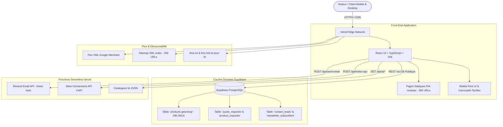

# 📸 GearShop.ma — Master System & Technical Architecture Documentation
**Plateforme E-Commerce Haute Performance pour Matériel Photo, Vidéo, Optiques Cinéma & Éclairage Professionnel au Maroc**

---

## 📑 Table des Matières
1. [Positionnement Stratégique & Analyse de Marché](#1-positionnement-stratégique--analyse-de-marché)
2. [Architecture Globale du Système](#2-architecture-globale-du-système)
3. [Base de Données & Catalogue Produits (Supabase)](#3-base-de-données--catalogue-produits-supabase)
4. [Front-End & Expérience Utilisateur (UI/UX Mobile First)](#4-front-end--expérience-utilisateur-uiux-mobile-first)
5. [Back-End, Sécurité & Fonctions Serverless](#5-back-end-sécurité--fonctions-serverless)
6. [Stratégie SEO, GEO & Référencement IA (AIO)](#6-stratégie-seo-geo--référencement-ia-aio)
7. [Génération du Flux Google Merchant & Sitemap](#7-génération-du-flux-google-merchant--sitemap)
8. [Moteur Marketing & Parcours de Conversion Omnicanal](#8-moteur-marketing--parcours-de-conversion-omnicanal)
9. [Bilan Technique & Perspectives d'Évolution](#9-bilan-technique--perspectives-dévolution)

---

## 1. Positionnement Stratégique & Analyse de Marché

### 🎯 Vision & Proposition de Valeur
**GearShop.ma** est conçu comme une vitrine digitale haute performance dédiée aux créateurs de contenu, photographes, vidéastes professionnels, maisons de production et passionnés d'audiovisuel au Maroc.

### 🥊 Grille Comparative Neutre
| Critère d'évaluation | Boutique E-Commerce Traditionnelle | GearShop.ma |
| :--- | :--- | :--- |
| **Architecture** | CMS monolithique (PHP / Base SQL lourde) | React 19 + TypeScript + Pré-rendu statique (SSG) + CDN Edge |
| **Recherche & Filtres** | Rechargement complet de page à chaque filtre | Filtrage en mémoire côté client sans rechargement de page |
| **Ergonomie Mobile** | Listes de boutons empilées verticalement | Carrousels tactiles horizontaux avec accroche native (`snap-x`) |
| **Catalogue Structuré** | Variable selon boutique | **280 références produits (SKUs)** prêtes et structurées |
| **Indexation IA (LLMs)** | Aucune structure dédiée aux agents IA | Fichiers natifs `llms.txt`, `llms-full.txt` et API JSON IA |
| **Attribution Publicitaire** | Pixels JavaScript client uniquement | Double intégration : Pixel client + Meta Conversions API serveur (`/api/meta-capi`) |

---

## 2. Architecture Globale du Système

---

## 3. Base de Données & Catalogue Produits (Supabase)

### 📊 Structure de la Table Principale : `products gearshop`
| Colonne | Type | Description & Utilisation |
| :--- | :--- | :--- |
| `id` | `text / int` | Identifiant unique du produit (ex: `6005`, `1002`). |
| `name` | `text` | Nom complet et commercial du produit. |
| `brand` | `text` | Marque officielle (Sony, Canon, Nikon, 7Artisans, Godox, DJI, etc.). |
| `category` | `text` | Catégorie parente (Boîtiers, Objectifs, Éclairage, Stabilisateurs, etc.). |
| `price` | `numeric` | Prix public en Dirhams Marocains (MAD). |
| `original_price` | `numeric` | Prix barré indicatif avant remise. |
| `image` | `text` | Chemin local WebP haute résolution (`/images/products/...`). |
| `inStock` | `boolean` | Disponibilité immédiate en inventaire. |
| `desc` | `text` | Description technique et commerciale. |
| `specs` | `jsonb / text` | Spécifications techniques détaillées (Monture, Capteur, etc.). |
| `featured` | `boolean` | Flag de mise en avant en vitrine. |

### 📋 Tables Actives du Schéma Supabase
* `quote_requests` : Demandes formelles de devis B2B et coordonnées d'entreprises.
* `product_requests` : Demandes de commande directe et précommandes.
* `contact_leads` : Messages du formulaire de contact.
* `newsletter_subscribers` : Inscriptions à la newsletter.
* `product_alerts` : Alertes de réapprovisionnement.
* `cookie_consents` : Journalisation du consentement cookies.
* `email_campaigns` : Historique des campagnes e-mail.
* `meta_capi_logs` : Journal des envois d'événements Meta CAPI.

> [!NOTE]
> **Gestion des commandes** : Les demandes de commande sont actuellement traitées via le workflow de leads/devis (`quote_requests` et `product_requests`). Une table relationnelle dédiée `orders` et `order_items` constitue une étape ultérieure pour l'automatisation complète de la facturation ERP.

---

## 4. Front-End & Expérience Utilisateur (UI/UX Mobile First)

### 📱 Optimisations Majeures pour Téléphones Mobiles
1. **Carrousels Tactiles Horizontaux** :
   - Remplacement des 20+ boutons empilés verticalement par deux carrousels horizontaux fluides (`overflow-x-auto snap-x scrollbar-none`).
   - Accès immédiat aux filtres de catégories et de marques sans pousser les produits en bas de l'écran.
2. **Barre de Recherche Intelligente** :
   - Placeholder adaptatif sans débordement sur petits écrans.
   - Filtrage instantané multi-critères (marque, modèle, mot-clé, prix) sans rechargement de page.
3. **Chargement Progressif des Produits (Pagination +12)** :
   - Chargement initial limité à 12 produits pour réduire le volume du DOM et améliorer la fluidité sur smartphone.
   - Bouton ergonomique : *« Afficher 12 produits suivants »*.
4. **Performance & Repli des Images** :
   - Utilisation de `loading="lazy"` et `decoding="async"`.
   - Repli automatique vers `/images/products/nikon-zr.webp` en cas de lien brisé.
5. **En-tête Épuré** :
   - Masquage des barres secondaires sur mobile (`hidden md:block`).

---

## 5. Back-End, Sécurité & Fonctions Serverless

### 🔐 Architecture Serverless (Vercel)
* `/api/send-email` : Envoi des devis et récapitulatifs par e-mail via l'API Resend sans exposer de clé privée côté client.
* `/api/meta-capi` : Envoi des événements de conversion côté serveur vers l'API Meta avec hachage SHA-256 des identifiants clients.
* `/api/ai/catalog.json` : Endpoint REST servant le catalogue complet formaté pour les agents et assistants IA.

### 🛡️ Sécurité & Bonnes Pratiques
* **Clés API** : Aucune clé secrète Meta ou Resend n'est injectée dans le code JavaScript client. Supabase utilise une clé publique (`anon`) encadrée par Row-Level Security.
* **Row-Level Security (RLS)** : La lecture anonyme des tables de leads clients est bloquée.
* **Recommandations de Durcissement** :
  1. *Contrôle d'accès par rôle (RBAC)* : Remplacer l'autorisation générique `TO authenticated` sur les leads par une vérification stricte du rôle administrateur (`role = 'admin'`).
  2. *Nettoyage HTML* : Passer les descriptions riches stockées au crible d'une bibliothèque de désinfection (type `DOMPurify`) avant injection via `dangerouslySetInnerHTML`.

---

## 6. Stratégie SEO, GEO & Référencement IA (AIO)

### 🚀 1. Pré-rendu Statique (SSG)
Chaque produit, catégorie, marque et page de ville marocaine possède son fichier `.html` pré-généré à la compilation :
* Découverte immédiate par les moteurs de recherche sans exécution JavaScript.
* Amélioration de l'accessibilité pour les robots d'indexation.

### 📍 2. URLs Canoniques Normalisées
* Chaque route indexable reçoit sa propre balise canonique auto-référencée sous `https://www.gearshop.ma/` pour éviter toute pénalité de contenu dupliqué.

### 🤖 3. Référencement pour Moteurs IA (ChatGPT, Claude, Gemini, Perplexity)
* `https://www.gearshop.ma/llms.txt` : Guide succinct structuré pour les LLMs.
* `https://www.gearshop.ma/llms-full.txt` : Fichier texte exhaustif (~375 Ko) documentant les 280 SKUs, prix en MAD et fiches techniques.
* `robots.txt` : Autorisation explicite des agents `GPTBot`, `ClaudeBot`, `PerplexityBot`, `Google-Extended`.

### 🏷️ 4. Microdonnées Enrichies (Schema.org / JSON-LD)
* Type `Product` avec `Offer` (devise `MAD`), disponibilité et marque.
* Type `BreadcrumbList` pour structurer le fil d'Ariane.
* Type `LocalBusiness` pour l'ancrage géographique au Maroc.

---

## 7. Génération du Flux Google Merchant & Sitemap

### 🛒 Flux Google Merchant Center
* **Fichier Généré** : `public/google-merchant-feed.xml` (`https://www.gearshop.ma/google-merchant-feed.xml`)
* **Format** : Flux RSS 2.0 XML Google Base.
* **Contenu** : 280 produits mappés avec titre, description, prix MAD, condition (`new`/`used`), catégorie Google Product et images WebP locales vérifiées.

### 🔍 Sitemap XML
* **Fichier Généré** : `public/sitemap.xml` (`https://www.gearshop.ma/sitemap.xml`)
* **Volume** : **356 URLs indexables** générées automatiquement à chaque compilation.

---

## 8. Moteur Marketing & Parcours de Conversion Omnicanal

### 🛒 Parcours Utilisateur & Options de Commande
* **Commande WhatsApp en 1 Clic** : Génération d'un message pré-rempli avec le nom exact du produit et le prix.
* **Formulaire Panier & Devis Direct** : Formulaire léger sans inscription obligatoire.
* **Calculateur de Livraison** : Mention dynamique de livraison offerte dès 500 MAD d'achat.

---

## 9. Bilan Technique & Perspectives d'Évolution

| Chantier Technique | État Actuel | Évolution Recommandée |
| :--- | :--- | :--- |
| **Front-End & Mobile** | React 19 + Carrousels tactiles + Pagination +12 | Analyse continue des métriques Real User Monitoring (RUM) |
| **Base de Données** | Supabase PostgreSQL + Table catalogue 280 SKUs | Création d'une table `orders` relationnelle avec passerelle de paiement |
| **Sécurité RLS** | Lecture anonyme bloquée | Implémentation d'une politique basée sur un rôle `admin` vérifié |
| **Sécurité Contenu** | Rendu HTML riche dans fiches produits | Intégration d'un module de désinfection HTML (`DOMPurify`) |
| **SEO & IA** | 356 URLs sitemap + SSG + `llms-full.txt` | Suivi des impressions Search Console et rapports Merchant Center |

---

*Document de référence technique — GearShop Maroc (Version 2.1 - Septembre 2026).*
