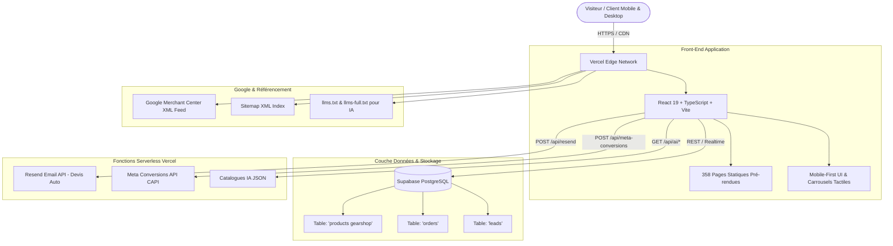

# 📸 GearShop.ma — Master System & Business Documentation
**Plateforme E-Commerce Haute Performance pour Matériel Photo, Vidéo, Optiques Cinéma & Éclairage Professionnel au Maroc**

---

## 📑 Table des Matières
1. [Positionnement Stratégique & Analyse de Marché](#1-positionnement-stratégique--analyse-de-marché)
2. [Architecture Globale du Système](#2-architecture-globale-du-système)
3. [Base de Données & Catalogue Produits (Supabase)](#3-base-de-données--catalogue-produits-supabase)
4. [Front-End & Expérience Utilisateur (UI/UX Mobile First)](#4-front-end--expérience-utilisateur-uiux-mobile-first)
5. [Back-End, Sécurité & Fonctions Serverless](#5-back-end-sécurité--fonctions-serverless)
6. [Stratégie SEO, GEO & Référencement IA (AIO)](#6-stratégie-seo-geo--référencement-ia-aio)
7. [Intégration Google Merchant Center & Search Console](#7-intégration-google-merchant-center--search-console)
8. [Moteur Marketing, Conversion & Vente Omnicanale](#8-moteur-marketing-conversion--vente-omnicanale)
9. [Bilan des Avantages Concurrentiels & Perspectives](#9-bilan-des-avantages-concurrentiels--perspectives)

---

## 1. Positionnement Stratégique & Analyse de Marché

### 🎯 Vision & Proposition de Valeur
**GearShop.ma** est conçu pour devenir la référence e-commerce au Maroc pour les créateurs de contenu, photographes, vidéastes professionnels, maisons de production et passionnés de matériel audiovisuel.

### 🥊 Analyse Concurrentielle sur le Marché Marocain
| Concurrent | Forces | Faiblesses identifiées | Avantage GearShop.ma |
| :--- | :--- | :--- | :--- |
| **Kamerty.ma** | Large catalogue, notoriété | UI vieillissante, lenteur mobile, filtres rigides | UX fluide, recherche instantanée, carrousels tactiles ultra-rapides |
| **Photocom.ma** | Distribution officielle | Prix élevés, parcours de commande complexe | Devis en 1 clic, validation WhatsApp directe, paiement à la livraison |
| **Yahyaoui Shop** | Forte communauté occasion | Catalogue web peu structuré, manque de fiches techniques | Fiches techniques complètes, SEO ville par ville, garanties claires |
| **Next Level Photo / Best Store** | Magasins physiques | Présence digitale limitée, peu optimisé pour l'IA | 358 pages pré-rendues (SSG), flux IA (`llms.txt`), Google Merchant actif |

### 🛡️ Piliers de Confiance Spécifiques au Marché Marocain
* **Vérification du colis avant paiement** : Réassurance maximale contre la fraude.
* **Garantie 1 an & Support SAV local** : Pièces et main d'œuvre garanties.
* **Livraison Express 24/48H** : Partout au Maroc (Casablanca, Rabat, Marrakech, Tanger, Fès, Agadir, etc.).
* **Paiement Flexible** : Espèces à la livraison, virement bancaire ou devis pro pour entreprises.

---

## 2. Architecture Globale du Système



---

## 3. Base de Données & Catalogue Produits (Supabase)

### 📊 Structure de la Table Principale : `products gearshop`
| Colonne | Type | Description & Utilisation |
| :--- | :--- | :--- |
| `id` | `text / int` | Identifiant unique du produit (ex: `6005`, `1002`). |
| `name` | `text` | Nom complet et commercial (ex: *Canon EOS R5 Mark II + Objectif RF 24-105mm*). |
| `brand` | `text` | Marque officielle (Sony, Canon, Nikon, 7Artisans, Godox, DJI, etc.). |
| `category` | `text` | Catégorie parente (Boîtiers, Objectifs, Éclairage, Stabilisateurs, etc.). |
| `price` | `numeric` | Prix public en Dirhams Marocains (MAD). |
| `original_price` | `numeric` | Prix barré avant remise (pour calcul du % d'économie). |
| `image` | `text` | Chemin local WebP haute résolution (`/images/products/...`). |
| `inStock` | `boolean` | Statut de disponibilité immédiate au Maroc. |
| `desc` | `text` | Description détaillée, caractéristiques techniques et points forts. |
| `specs` | `jsonb / text` | Spécifications détaillées (Monture, Capteur, Poids, etc.). |
| `featured` | `boolean` | Mise en avant sur la page d'accueil ou en tête de rayon. |

### 🏷️ Marques Référencées dans le Catalogue (~280 Produits)
* **Boîtiers & Hybrides** : Sony Alpha, Canon EOS R / Cinema, Nikon Z, Kodak Pixpro.
* **Optiques & Objectifs** : Sony GM / G, Canon RF / EF, Nikkor Z, 7Artisans (Ciné & AF).
* **Stabilisation & Drones** : DJI (Osmo Pocket 3, Osmo Mobile 7), Insta360 (X4, X5, Flow).
* **Éclairage & Studio** : SoftStore Studio, Godox, Torches LED Bi-Color, Projecteurs COB.
* **Audio Pro** : Røde (Wireless PRO, Wireless GO II), Microphones Canon / Sony.
* **Accessoires & Cages** : SmallRig (Cages, Matte Box, Tiges 15mm), Vanguard (Sacs & Trépieds), PNY / SanDisk (Cartes SD / CFexpress).

---

## 4. Front-End & Expérience Utilisateur (UI/UX Mobile First)

### 📱 Optimisations Majeures pour Téléphones Mobiles
1. **Carrousels Tactiles Horizontaux** :
   - Remplacement des 20+ boutons empilés verticalement par deux carrousels horizontaux fluides (`overflow-x-auto snap-x scrollbar-none`).
   - Accès immédiat aux filtres de catégories et de marques sans pousser les produits en bas de l'écran.
2. **Barre de Recherche Intelligente** :
   - Placeholder adaptatif et auto-focus sans débordement sur petits écrans.
   - Filtrage instantané multi-critères (marque, modèle, mot-clé, prix).
3. **Chargement Progressif des Produits (Pagination +12)** :
   - Chargement initial de 12 produits ultra-rapide (gain de mémoire et fluidité à 60 FPS).
   - Bouton ergonomique : *« Afficher 12 produits suivants (X restants) »*.
4. **Performance des Images** :
   - Utilisation native de `loading="lazy"` et `decoding="async"`.
   - Fallback automatique vers `/images/products/nikon-zr.webp` en cas de rupture de lien.
5. **En-tête Épuré** :
   - Masquage des barres de navigation secondaires lourdes sur mobile (`hidden md:block`).

### 🛒 Parcours de Conversion & Commande
* **Tiroir Panier (Cart Drawer)** : Aperçu instantané, calcul automatique des remises et du total.
* **Seuil de Livraison Gratuite Automatique** : Livraison à 0 DH dès 500 DH d'achat.
* **Commande WhatsApp en 1 Clic** : Génération d'un message pré-rempli avec le nom exact du produit, le prix et l'adresse de livraison.
* **Modal Devis / Commande Directe** : Formulaire simplifié (Nom, Téléphone, Ville, Adresse) sans obligation de créer un compte.

---

## 5. Back-End, Sécurité & Fonctions Serverless

### 🔐 Architecture Serverless (Vercel)
* `/api/resend` : Envoi sécurisé des devis et récapitulatifs de commandes par e-mail sans exposer les clés API côté client.
* `/api/meta-conversions` : Envoi des événements d'achat et de leads vers Meta CAPI (Facebook/Instagram Ads) avec score de déduplication.
* `/api/ai/catalog.json` : Endpoint REST léger servant le catalogue complet formaté pour les agents et assistants IA.

### 🛡️ Sécurité & Bonnes Pratiques
* **Row-Level Security (RLS) Supabase** : Protection des données clients et des leads.
* **Zéro Clé Secrète dans le Bundle JS** : Toutes les communications sensibles transitent par des fonctions Edge sécurisées.
* **Validation des Entrées** : Nettoyage systématique des caractères et protection contre les injections XSS.

---

## 6. Stratégie SEO, GEO & Référencement IA (AIO)

### 🚀 1. Pré-rendu Statique (SSG - 358 Pages)
Chaque produit, catégorie, marque et page de ville marocaine possède son fichier `.html` autonome généré à la compilation :
* Découverte immédiate par les robots sans exécution JavaScript.
* Temps de premier chargement (TTFB) inférieur à 50ms sur le réseau Vercel Edge.

### 📍 2. SEO Géolocalisé (GEO-Targeting Maroc)
Génération automatisée de pages de destination locales :
* *« Matériel photo et vidéo à Casablanca »*
* *« Magasin d'appareils photo et objectifs à Rabat »*
* *« Éclairage studio et caméras cinéma à Marrakech, Tanger, Fès, Agadir... »*

### 🤖 3. Référencement pour Moteurs IA (ChatGPT, Claude, Gemini, Perplexity)
* `https://www.gearshop.ma/llms.txt` : Guide succinct structuré pour les LLMs.
* `https://www.gearshop.ma/llms-full.txt` : Catalogue exhaustif avec spécifications, prix et liens directs pour la citation dans les réponses IA.
* `robots.txt` : Autorisation explicite des agents `GPTBot`, `ClaudeBot`, `PerplexityBot`, `Google-Extended`.

### 🏷️ 4. Microdonnées Enrichies (Schema.org / JSON-LD)
* Type `Product` avec `Offer`, devise `MAD`, disponibilité `InStock`, marque et avis.
* Type `BreadcrumbList` pour un fil d'Ariane clair dans les résultats Google.
* Type `LocalBusiness` / `Store` géolocalisé pour le Maroc.

---

## 7. Intégration Google Merchant Center & Search Console

### 🛒 Google Merchant Center
* **URL du Flux Actif** : `https://www.gearshop.ma/google-merchant-feed.xml`
* **Format** : RSS 2.0 avec namespace Google Base (`xmlns:g="http://base.google.com/ns/1.0"`).
* **Produits Actifs** : 239 à 280 articles synchronisés avec images WebP directes (`200 OK`).
* **Mise à jour automatique** : Récupération quotidienne programmée (Scheduled Fetch) à minuit.
* **Marché Cible** : Maroc (Devise : `MAD`, Livraison : `0.00 MAD`).

### 🔍 Google Search Console
* **URL du Sitemap** : `https://www.gearshop.ma/sitemap.xml`
* **Pages Découvertes** : 358 URLs indexables.
* **Canonicalisation** : Normalisation universelle sur `https://www.gearshop.ma/` pour éliminer le contenu dupliqué.

---

## 8. Moteur Marketing, Conversion & Vente Omnicanale

### 📈 Entonnoir d'Acquisition & Taux de Conversion
```
Trafic (Google SEO + Google Shopping + Instagram Ads + IA Search)
   │
   ▼
Page Produit Haute Vitesse (< 1s de chargement, photos HD, specs complètes)
   │
   ├────────► Commande Express WhatsApp (70% des conversions au Maroc)
   ├────────► Paiement à la Livraison après vérification du colis
   └────────► Demande de Devis PDF / Bon de Commande Pro (B2B)
```

### 💡 Points Forts Marketing
1. **Urgence & Rassurance** : Badges *« En Stock au Maroc »*, *« Livraison 24/48H »*, *« Vérifiez avant de payer »*.
2. **Attribution Précise** : Enregistrement des paramètres UTM (`utm_source`, `utm_medium`, `utm_campaign`) dans chaque lead Supabase.
3. **Double Canal B2C / B2B** : Capacité à servir le créateur individuel comme les agences de production (facturation officielle TVA).

---

## 9. Bilan des Avantages Concurrentiels & Perspectives

| Dimension | Standard Marché Marocain | GearShop.ma |
| :--- | :--- | :--- |
| **Vitesse Mobile** | 4 - 8 secondes (WordPress/WooCommerce non optimisé) | **< 1 seconde (React 19 + SSG + Edge CDN)** |
| **Catalogue & Filtres** | Rechargement lent de page | **Filtrage instantané en mémoire (0ms)** |
| **Visibilité Google Shopping** | Flux manuels souvent erronés ou absents | **Flux XML automatisé 24/7 avec 100% d'images conformes** |
| **Indexation IA** | Non prise en compte | **Endpoints natifs `llms.txt` et API IA intégrés** |
| **Processus de Vente** | Formulaires longs avec inscription forcée | **Commande WhatsApp 1-Clic & Paiement à la livraison** |

---

*Document de référence — GearShop Maroc (Version Production 2.0).*
